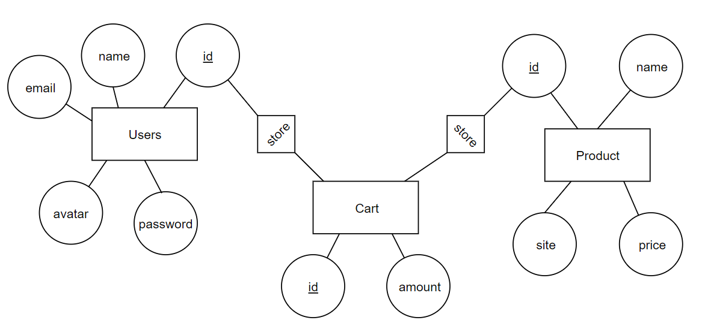

I have 3 tables. The Product table stores the name, price, and url to the product photo. The Users table stores all the relevant data about the user. The Cart table stores the user_id and product_id and stores the products added to the cart.